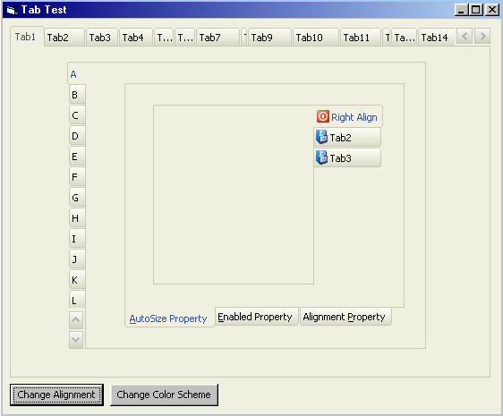



## xpWellsTab Version 2

### Description

A Tab strip control emulating the look of Win XP

Looks the same as version 1 but more features.
 
### More Info
 

             |
---                |---
**Submitted On**   |2003-04-13 14:21:44
**By**             |[Richard Wells](https://github.com/Planet-Source-Code/PSCIndex/blob/master/ByAuthor/richard-wells.md)
**Level**          |Advanced
**User Rating**    |4.8 (95 globes from 20 users)
**Compatibility**  |VB 5\.0, VB 6\.0
**Category**       |[Custom Controls/ Forms/  Menus](https://github.com/Planet-Source-Code/PSCIndex/blob/master/ByCategory/custom-controls-forms-menus__1-4.md)
**World**          |[Visual Basic](https://github.com/Planet-Source-Code/PSCIndex/blob/master/ByWorld/visual-basic.md)
**Archive File**   |[xpWellsTab1573564142003\.zip](https://github.com/Planet-Source-Code/richard-wells-xpwellstab-version-2__1-44739/archive/master.zip)

